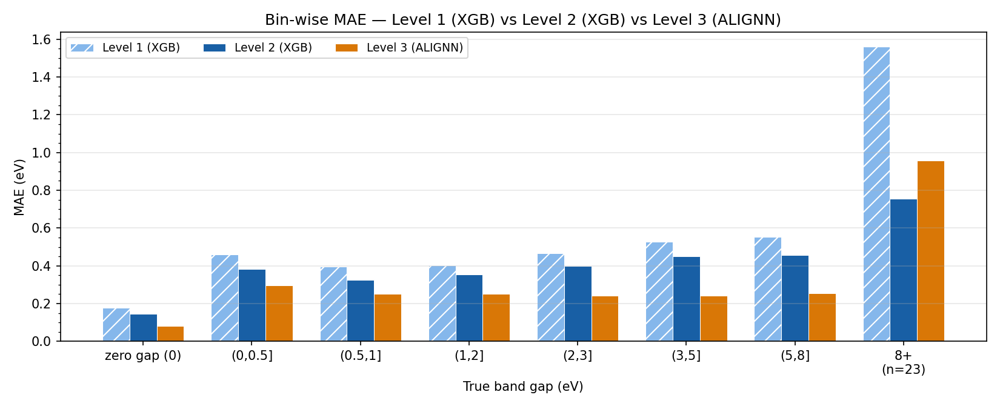
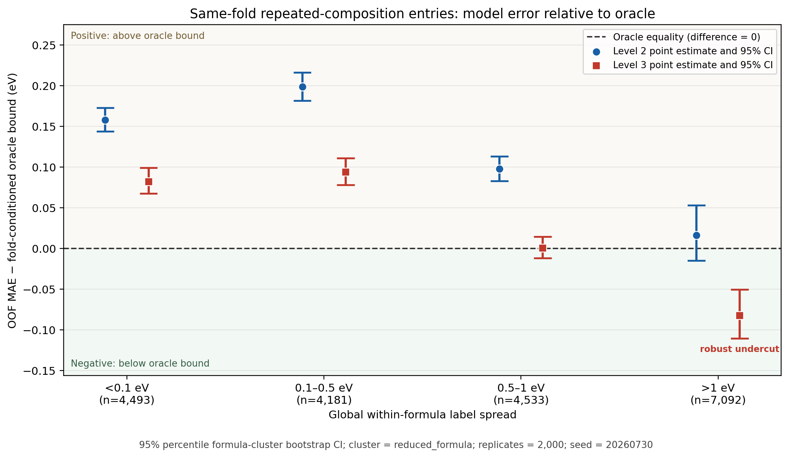

# How Much Structure Does Band-Gap Prediction Need?

## A Fold-Controlled Representation–Learner Audit from Composition to Graphs on MatBench `mp_gap`

This repository is the reproducibility companion to the preprint **“How Much Structure Does Band-Gap Prediction Need? A Fold-Controlled Representation–Learner Audit from Composition to Graphs on MatBench mp_gap.”** It audits three representation–learner pipelines on the 106,113-entry MatBench `mp_gap` task:

1. **Level 1 — composition:** 132 Magpie `ElementProperty` features with XGBoost;
2. **Level 2 — composition plus engineered descriptors:** 283 composition and structure columns with XGBoost;
3. **Level 3 — atomistic graph:** ALIGNN with line-graph geometry.

“Fold-controlled” means that the levels use the same targets, official MatBench test folds, scoring metrics, and non-negativity post-processing. It does **not** mean that learner, direct model-fitting fraction, optimizer, or training budget are matched. In particular, the Level-2-to-Level-3 arm is a representation–learner–training contrast, not a representation-only experiment.

Approximate direct model-fitting fractions are 64% for XGBoost, 72% for ALIGNN, and 80% for random forest. For Level 2, 64% refers to tree-parameter fitting; preprocessing statistics use the complete official outer-training fold, with official-test entries excluded.

Unless explicitly marked **diagnostic**, paper-facing benchmark results use the frozen, non-negative, out-of-fold predictions on the official MatBench splits.



## Headline results

Fold dispersions below are population standard deviations across the five fixed official folds (`ddof=0`), recomputed from the frozen predictions.

| Model | Representation | MAE (eV) | RMSE (eV) | R² |
|---|---|---:|---:|---:|
| Level 1, RF | Composition | 0.3281 ± 0.0032 | 0.5973 ± 0.0065 | 0.8604 ± 0.0026 |
| Level 1, XGB | Composition | 0.3380 ± 0.0050 | 0.5872 ± 0.0084 | 0.8651 ± 0.0030 |
| Level 2, RF | Composition + descriptors | 0.3379 ± 0.0041 | 0.5845 ± 0.0087 | 0.8664 ± 0.0026 |
| Level 2, XGB | Composition + descriptors | 0.2855 ± 0.0030 | 0.4987 ± 0.0075 | 0.9027 ± 0.0021 |
| Level 3, ALIGNN | Atomistic graph | 0.1797 ± 0.0029 | 0.4698 ± 0.0077 | 0.9136 ± 0.0026 |

The main findings are:

- Along the primary XGBoost-to-ALIGNN ladder, MAE decreases from **0.3380 → 0.2855 → 0.1797 eV**.
- Under the fixed single-seed Level-2 protocol capped at 8,000 rounds, deleting coordination fingerprints does not worsen MAE (**ΔMAE = −0.0053 eV**), whereas deleting global symmetry raises MAE by **0.0287 eV**. Gross SHAP attribution share and retrain-after-removal response are different fitted-pipeline quantities; neither is treated as a causal contribution.
- On the aggregate fold-conditioned repeated-composition domain, Level 3 remains **+0.0088 eV** above the empirical oracle and the 95% pointwise formula-cluster interval spans zero (**[−0.0083, +0.0250] eV**). Only in the post hoc **>1 eV global within-formula-spread stratum** does the entire unadjusted pointwise interval lie below zero (**−0.0824 eV [−0.1106, −0.0505]**).
- On exact-zero PBE targets, the formally comparable Level-1-to-Level-3 raw-prediction IQR contracts **35.6-fold** (0.1356 → 0.0038 eV), and **93.3%** of entries move closer to zero. Level-2 raw predictions are diagnostic only.
- Non-negativity clipping creates an exact-zero-error atom that grows from **15.0% to 18.5%** of all entries. On the atom-free positive-gap subset, median absolute error falls **2.47-fold** (0.3203 → 0.1297 eV), but the advantage reverses between P95 and P99. Across the full dataset, the worst 1% of Level-3 errors account for **56.0%** of its SSE.
- In a configuration-matched fold-0 control, suppressing numerical angle values while retaining line-graph topology raises clipped MAE by **0.01453 eV (8.2%)**, computed from the unrounded official-test MAEs. This is a single-fold ablation, not a decomposition of the complete Level-2-to-Level-3 difference.



## Before running scripts: preserve the frozen release

> **Treat the distributed manuscript outputs as read-only.** Several public scripts retain historical default output directories that are already populated in this release. Some deliberately refuse a non-empty directory; older scripts may overwrite same-named derived files if run in place. Do not delete or repurpose frozen outputs merely to rerun a script.

The protected release artifacts include `results/`, `figure/`, `outputs_v1_run0709/`, `matbench_outputs_v2_run0709/`, `results_v4/`, the angle-mask prediction directory, and the historical comparison/training result directories.

Use these rules:

1. If a script exposes `--output-dir`, give it a **new, empty directory** for every run.
2. `compare_l1_bandcenter_l2_l3.py` and `analyze_l1_bandcenter_l2_l3_error_tails.py` always refuse non-empty output directories.
3. `train_l1_plus_bandcenter.py` also refuses a non-empty output directory unless `--resume` is continuing an interrupted run with the same validated run signature. `--resume` is not an overwrite flag and must not be used on the completed release directory.
4. `shap_crossfold_aggregate_audited_v3.py` enforces a 25-file output contract and rejects directories containing unrelated visible files. A fresh directory is still the recommended route.
5. Scripts with a top-of-file `OUT_DIR`, `OUTPUT_DIR`, or similar constant retain their historical locations. Point that constant to a new private working directory, or run the script in a disposable copy of the repository. These historical paths were intentionally not rewritten one by one.
6. Terminal-only verification scripts need no output directory.
7. `train_ids_export.py` records the one-off step used to add one `train_ids.pkl` file for each of the five official folds. It is retained for provenance only and is not required for ordinary reproduction; do not run it against the frozen release directories.

The examples below create a parent run directory but leave each script-specific child directory absent until the corresponding script creates it:

```bash
cd scripts

RUN_TAG=$(date +%Y%m%d_%H%M%S)
REPRO_RUN="../reproduction_runs/${RUN_TAG}"
mkdir -p "$REPRO_RUN"
```

Do not reuse the same `RUN_TAG` after its child directories contain output.

## Reproduction routes

The repository separates numerical verification from feature regeneration and full model training. Most headline downstream analyses can be recomputed without model retraining.

| Route | Inputs | Typical scope | Training required? |
|---|---|---|---:|
| Frozen-output analysis | Distributed predictions, labels, SHAP arrays, compact tables | Main metrics, provenance, boundary/tail analysis, repeated-composition oracle, SHAP aggregation, deletion fold audit | No |
| Cache-dependent analysis | `matbench_cache/` plus the frozen sources | Featurizer failures, subset robustness, octahedral/TM checks, beeswarm reconstruction, tree replay and descriptor controls | Sometimes |
| Full retraining | Canonical notebooks or Colab scripts, features/exports, complete environments | Level-1/2 models, deletion/BandCenter controls, ALIGNN and angle mask | Yes |

### Route A: analyses from frozen outputs

Create the portable tree-analysis environment:

```bash
conda env create -f ../environments/tree_analysis.yml
conda activate mp-gap-tree-analysis
```

The fuller `environments/tree_analysis_macos_arm64_lock.yml` records the original macOS arm64 environment; it is archival rather than a portable cross-platform specification.

The following safe sequence uses new output directories. Commands are shown after `cd scripts` and assume the `REPRO_RUN` variable defined above.

```bash
# Four-model alignment and official-fold metrics
python compare_l1_bandcenter_l2_l3.py \
  --output-dir "$REPRO_RUN/four_model_comparison"

# Quantiles, SSE concentration, clipping atom, and directional counts
python analyze_l1_bandcenter_l2_l3_error_tails.py \
  --comparison-results-dir "$REPRO_RUN/four_model_comparison" \
  --output-dir "$REPRO_RUN/error_tails"

# Fold-conditioned repeated-composition oracle and formula-cluster bootstrap
python polymorph_bound_fold_conditioned_v3.py \
  --output-dir "$REPRO_RUN/repeated_composition_oracle"

# Cross-fold SHAP aggregation, deletion summary, and L1-to-L2 transfer
python shap_crossfold_aggregate_audited_v3.py \
  --full-l2-score ../results/frozen_scores/level2/scores_xgb.txt \
  --output-dir "$REPRO_RUN/shap_audit" \
  --fail-on-reference-mismatch
```

The SHAP reference tolerance is an audit tolerance for floating-point accumulation. It does not change the SHAP arrays, aggregation rule, manuscript values, or figures.

The deletion fold verifier is read-only and writes nothing:

```bash
python verify_deletion_per_fold.py
```

It prints official-test MAE for the full Level-2 model and each deletion arm in every fold, followed by equal-weight five-fold summaries with `ddof=0`. The expected mean contrasts are approximately **−0.005315 eV** for coordination deletion and **+0.028701 eV** for symmetry deletion.

Other frozen-output audits, including raw provenance, zero-gap fold stability, binned errors, chemical-family summaries, and R² conventions, are available under `scripts/`. Some retain fixed historical output constants; follow the release-preservation policy above instead of running their defaults against the curated checkout.

### Route B: cache-dependent analyses

`matbench_cache/` is a 1.09 GiB (1,167,993,419-byte), version-sensitive engineered-feature cache rather than an ordinary download cache. It is excluded from the lightweight Git repository and is distinct from `gnn_export/`. The release-associated frozen cache is packaged as its own archive in the version-matched Zenodo dataset record described under [External large-data record](#external-large-data-record). After verification and extraction, its expected repository-relative path is `matbench_cache/`.

The full-run path in `notebooks/mp_gap_baseline_v2_run0709.ipynb` generated this cache by applying eight featurizer families separately to the official outer-training and test structures for each of five folds, producing **5 folds × 2 splits × 8 families = 80** per-family pickle files. Freezing those exact outputs avoids rerunning version-sensitive feature generation and lets cache-dependent analyses consume the same recorded inputs.

Cache-dependent tasks include:

- Level-1 + BandCenter training;
- Level-2 deterministic replay and deletion retraining;
- featurizer-failure and subset-robustness checks;
- octahedral/transition-metal confounding checks;
- reconstruction of fold-0 SHAP beeswarms.

Frozen predictions and compact outputs are sufficient for the headline numerical audit, so Route A does not require the cache. The tasks listed above do require the version-matched frozen cache; restoring it avoids silent changes from regenerating features with a different software stack.

After restoring the frozen cache, the BandCenter training control must use a fresh output directory:

```bash
python train_l1_plus_bandcenter.py \
  --cache-dir ../matbench_cache \
  --output-dir "$REPRO_RUN/l1_plus_bandcenter_training"
```

Use `--resume` only to continue that same interrupted directory after its run-signature checks pass.

### Route C: full retraining

The canonical frozen tree-model training records are:

- `notebooks/mp_gap_baseline_v1_run0709.ipynb`;
- `notebooks/mp_gap_baseline_v2_run0709.ipynb`.

Python exports and deterministic replay scripts are supporting records, not alternative canonical training pipelines. The notebooks in `archive/legacy_diagnostic/` are retained only to explain historical raw-prediction provenance.

The recorded Level-2 notebook run also wrote four core GNN-export files per fold—`train_inputs.pkl`, `train_outputs.pkl`, `test_inputs.pkl`, and `test_ids.pkl`—for 20 files in total. The supplementary `scripts/train_ids_export.py` reads each official outer-training index from MatBench and adds one `train_ids.pkl` per fold, giving the released 25-file `gnn_export/` bundle. Neither step writes test-label files. The supplementary script uses the release's Python 3.9 / MatBench 0.6 contract and verifies the expected v1.0.0 size and SHA-256 of every training-ID file before any write.

`scripts/release/prepare_zenodo_data_release.py` only validates the two frozen directories, computes manifests and checksums, and packages them deterministically. It does not rerun data extraction, featurization, or model training.

ALIGNN training and the explicit-angle control were run in a GPU-enabled Google Colab environment. The entry points are:

- `scripts/colab/v4_alignn_matbench_mp_gap_fixed_final_fi.py` — frozen five-fold ALIGNN pipeline;
- `scripts/colab/v4_alignn_matbench_mp_gap_angle_zero_fold0.py` — configuration-matched fold-0 angle-mask control.

Both entry points require the version-matched `gnn_export/` bundle from the external data record. With the recorded Colab defaults, the project/data root is `/content/drive/MyDrive/matbench_alignn/`; another layout requires changing the top-of-file path constants.

The core Colab stack is installed with:

```bash
bash ../environments/install_alignn_colab.sh
```

The historical transitive Colab dependency set was not completely archived; see `environments/README.md`. Frozen official-test predictions, rather than full retraining, are the primary downstream audit entry point.

## Repository map

| Path | Contents |
|---|---|
| `notebooks/` | Canonical Level-1 and Level-2 frozen training notebooks |
| `archive/legacy_diagnostic/` | Superseded notebooks retained only for provenance |
| `scripts/` | Analysis, audit, replay, control-training, and figure entry points |
| `scripts/colab/` | Frozen ALIGNN and angle-mask Colab training scripts |
| `environments/` | Portable analysis environment, archival platform record, and Colab installer |
| `figure/` | Frozen manuscript and Supporting Information figures |
| `results/` | Curated scores, tables, audit reports, configurations, and replay records |
| `outputs_v1_run0709/` | Frozen Level-1 predictions, SHAP arrays, feature names, and training metadata |
| `matbench_outputs_v2_run0709/` | Frozen Level-2 predictions and SHAP artifacts |
| `matbench_outputs_v2_ablation_symmetry/`, `matbench_outputs_v2_ablation_coordination/` | Frozen five-fold deletion predictions, scores, and available training curves |
| `results_v4/` | Frozen Level-3 raw and clipped per-fold predictions |
| `result_v4_angle_zero_fold0/` | Fold-0 angle-mask raw and clipped predictions |
| `matbench_outputs/` | Archived Level-1 and older-imputation Level-2 raw arrays used by the provenance audit |
| `gnn_export/` | Externally distributed official-fold train/test structure and identifier export with training labels and no test-label files; place here after extraction; not tracked in Git |
| `matbench_cache/` | Externally distributed frozen engineered-feature cache; place here after extraction; not tracked in Git |
| `MANIFEST.csv` | Release-path, role, size, and checksum metadata; regenerate after the tree is final |
| `SCRIPT_INDEX.csv` | Curated canonical/supporting status and release path; update and validate against the final tree |
| `SHA256SUMS.txt` | File-integrity checksums; regenerate after the tree is final |
| `LARGE_DATA_SHA256SUMS.txt` | Approved archive-level checksums for the two finalized external large-data bundles |
| `ARCHIVE_ONLY.txt` | Exploratory or superseded files intentionally excluded from the public analysis surface |
| `DECISION_LEDGER.md` | Sanitized record of consequential analytical, provenance, and reporting decisions underlying the released manuscript |

Historical directory names are retained because they are referenced by frozen audits. They do not define additional model levels.

### External large-data record

Large artifacts are excluded from Git. The release-associated `gnn_export/` bundle and engineered-feature `matbench_cache/` are packaged as two separately downloadable, versioned archives for one Zenodo **Dataset** record.

| Restored directory | Archive file | Extracted contents | Archive bytes | Extracted files / bytes | Required for | Required for frozen-output Route A? |
|---|---|---|---:|---:|---|---:|
| `gnn_export/` | `mp_gap_gnn_export_v1.0.0.tar.gz` | Five official folds of train/test structures and identifiers plus training labels; no test-label files | 382,354,434 | 25 / 2,141,092,523 | Full ALIGNN and angle-mask retraining | No |
| `matbench_cache/` | `mp_gap_matbench_cache_v1.0.0.tar.gz` | Frozen outputs for 5 folds × train/test × 8 featurizer families | 443,839,749 | 80 / 1,167,993,419 | Level-2/BandCenter training and replay, deletion retraining, and cache-dependent SI audits | No |

Version-specific data DOI: **[10.5281/zenodo.22038572](https://doi.org/10.5281/zenodo.22038572)**

The data record contains exactly six files: the two archives above, `DATA_README.md`, a data-record-specific `LICENSES_AND_ATTRIBUTION.md`, `DATA_FILE_MANIFEST.csv`, and `LARGE_DATA_SHA256SUMS.txt`. The data-record license file is self-contained for the Zenodo deposit and is distinct in scope from the repository-wide file of the same name.

After downloading, verify each archive against `LARGE_DATA_SHA256SUMS.txt`, then extract both at repository root so that the restored paths are exactly `gnn_export/` and `matbench_cache/`. `DATA_FILE_MANIFEST.csv` records relative path, byte size, and SHA-256 for every extracted member. Both bundles contain Python pickle files and should be loaded only from the checksummed project record with the documented environments.

The repository's `SHA256SUMS.txt` covers the lightweight Git-distributed files. `LARGE_DATA_SHA256SUMS.txt` covers the exact external archive payloads and should be included in both the Git release and the Zenodo data record.

## Prediction provenance

The three raw-prediction sources have different evidential status.

| Level | Raw artifact | Frozen clipped artifact | Status |
|---|---|---|---|
| Level 1 | `matbench_outputs/v1_predictions_xgb/` | `outputs_v1_run0709/predictions_xgb/` | **Formal frozen-equivalent reconstruction.** Clipping the archived raw array reproduces all 106,113 frozen predictions exactly; direct identity is verified on every strictly positive archived raw value, while the negative endpoint additionally relies on deterministic model identity. |
| Level 2 | `matbench_outputs/v2_predictions_xgb/` | `matbench_outputs_v2_run0709/predictions_xgb/` | **Diagnostic only.** The raw archive used the older imputation policy; 6,984 clipped entries differ from the frozen Level-2 predictions. It is excluded from formal raw endpoint and clipping-gain claims. |
| Level 3 | `results_v4/fold_*/test_preds.npz` | `results_v4/fold_*/test_preds_clipped.npz` | **Formal same-run source.** Raw and clipped arrays come from the same frozen run and reconcile exactly. |

The complete reconciliation is documented in `results/audits/raw_provenance_audit.md`.

Some source artifacts originally recorded absolute paths from the generation environment. Public release copies must remove or sanitize private home-directory paths, local host identifiers, and credentials without changing numerical contents. Generic Colab paths under `/content/` may remain because they do not identify a private workstation. Reproduction uses the release-relative paths and commands documented here, and the full-tree finalization scan is the governing publication gate.

For frozen Level 2, feature means were computed from the complete official outer-training fold before the internal 80%/20% fit/validation split. Internal-validation covariates therefore contributed to the means; their targets contributed only to validation monitoring, and official-test entries contributed to none of the preprocessing, fitting, or checkpoint-selection steps. The reported 64% fraction describes XGBoost parameter fitting, not preprocessing-statistic estimation.

## Analysis conventions

- Comparative performance tables use `ddof=0`; run-specific training summaries use their explicitly stated convention.
- The standalone Level-1 + BandCenter training summary retains its recorded `ddof=1`; the final four-model comparison recomputes all fold dispersions with `ddof=0`.
- SHAP fold-to-fold whiskers use sample SD (`ddof=1`) and are not confidence intervals.
- Headline predictions are clipped to `[0, ∞)` before benchmark scoring.
- `true zero-gap` means an exact-zero PBE target; it is not proof of experimental metallicity.
- `positive-gap near-zero placement` means `y > 0` and `prediction < 0.1 eV`. It is a descriptive directional event, not a balanced classification-error metric and not necessarily a large regression error.
- The repeated-composition oracle is the post hoc empirical MAE minimum for formula-fold-constant predictors on the observed test labels. It is not a prospective benchmark, theoretical lower bound, or universal irreducible error.
- Global within-formula spread strata are post hoc; their formula-cluster intervals are pointwise, unadjusted for four bin comparisons, and condition on frozen predictions.
- Gross coordinatewise SHAP share, per-column attribution density, and fixed-pipeline deletion response are different quantities and are not causal contributions.

## Figure provenance and historical labels

| Figure files | Primary generating script |
|---|---|
| `bin_mae_level_comparison.png`, `bin_mae_improvement.png`, `absolute_error_quantile_curves.png`, and binned bias/count supplements | `scripts/bandgap_error_analysis_v8.py` |
| `polymorph_bound_by_spread.png`, `polymorph_bound_delta_ci_by_spread.png` | `scripts/polymorph_bound_fold_conditioned_v3.py` |
| `v1_audited_v3_shap_*`, `v2_audited_v3_shap_*` | `scripts/shap_crossfold_aggregate_audited_v3.py` |
| Fold-0 XGB/RF SHAP beeswarms | `scripts/remake_shap_figs_english.py`, `scripts/remake_shap_figs_english_v2.py` |
| `xgb_mae_curve_fold_0.png` | `scripts/mp_gap_replay_fold0_curve.py` |
| `metal_raw_hist.png` | `scripts/neg_and_family_analysis_v4.py` |

The frozen SHAP figures retain the historical label **“Bond strength (comp)”**. It denotes six Magpie statistics of elemental melting temperatures, not a measured compound bond-strength descriptor.

The filename `metal_raw_hist.png` is also historical. The corresponding figure and governing text concern exact-zero PBE targets; the filename does not classify those entries as experimentally metallic.

The canonical oracle figures are retained exactly as generated by the public script. Their historical label **“oracle bound”** denotes the empirical repeated-composition oracle defined above, not a universal bound. The historical **“robust undercut”** annotation means only that the unadjusted pointwise formula-cluster interval in the post hoc `>1 eV` global-spread stratum lies below zero; it is not an aggregate or multiplicity-adjusted robustness claim. The manuscript text and figure captions provide the governing interpretation.

## Integrity and release metadata

Finalize release metadata only after the README, scripts, decision ledger, configurations, figures, and external archives are final. The release tool scans all tracked and non-ignored files for private paths, common secret patterns, symlinks, oversized files, missing required files, and script-index drift before writing `MANIFEST.csv` and `SHA256SUMS.txt`. The curated `SCRIPT_INDEX.csv` is validated rather than reconstructed from filenames. `LARGE_DATA_SHA256SUMS.txt` already records the exact two approved external archives; their extracted-file manifest belongs in the version-matched data record.

Run from the repository root before staging files:

```bash
python scripts/release/finalize_repository_release.py --write
python scripts/release/finalize_repository_release.py --check
```

Do not run `git add` unless both commands pass. After checkout or download, verify the finalized file set with:

```bash
# macOS
shasum -a 256 -c SHA256SUMS.txt

# Linux
sha256sum -c SHA256SUMS.txt
```

The script index should identify the two `run0709.ipynb` notebooks as canonical tree-training records and Python exports/replay scripts as supporting artifacts.

## Limitations

- Targets are PBE calculations rather than experimental band gaps.
- Official random folds may place identical formulas or near-duplicate structures on both sides of the train/test split.
- The Level-2-to-Level-3 contrast changes representation, learner, optimizer, direct fitting fraction, and training budget.
- Frozen Level-2 preprocessing shares outer-training covariates with the later internal validation subset; official-test entries remain excluded from all training-stage operations.
- Primary models use one random seed; fold dispersion is not seed variance.
- Deletion retraining covers two feature groups under a fixed 8,000-round cap; the small negative coordination response is not interpreted as convergence-stable.
- SHAP audits training-fold samples and gross coordinatewise magnitudes; it does not measure signed within-group cancellation or out-of-fold explanation stability.
- Engineered-featurizer failures are non-random.
- Oracle spread strata are post hoc, intervals are not multiplicity-adjusted, and bootstrap uncertainty excludes refitting, random seeds, and model selection.
- The angle mask covers one fold and one seed.
- Same reduced formula is a candidate-polymorph criterion, not proof that every group contains distinct experimental polymorphs.
- The 8+ eV target bin contains only 23 entries and is displayed but not interpreted.

## Citation

If you use this repository, please cite the accompanying manuscript:

> *How Much Structure Does Band-Gap Prediction Need? A Fold-Controlled Representation–Learner Audit from Composition to Graphs on MatBench mp_gap.* Preprint record forthcoming.

## License

Original project code is released under the MIT License in [`LICENSE`](LICENSE). Project-authored documentation, figures, and frozen outputs are released under CC BY 4.0 to the extent that the author holds the relevant rights. Upstream data, code, interfaces, names, and notices remain subject to their own terms. See [`LICENSES_AND_ATTRIBUTION.md`](LICENSES_AND_ATTRIBUTION.md) and [`THIRD_PARTY_NOTICES.md`](THIRD_PARTY_NOTICES.md) for scope, attribution, and preserved notices; this README does not independently grant or expand rights.

## Acknowledgment of AI assistance

Anthropic Claude and OpenAI ChatGPT were used for analysis discussion, code drafting, literature-search assistance, and language editing. All scientific decisions, source verification, computations, and final text remain the author’s responsibility.
